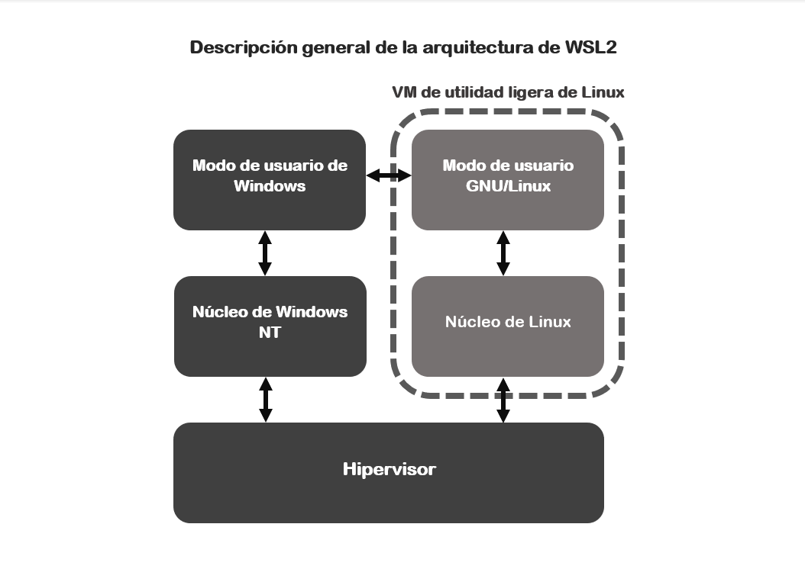

# <b>¿QUÉ ES WSL 2?</b>

Windows Subsystem for Linux 2, mejor conocido como WSL 2, es una versión más reciente y fácil de usar de WSL, la cual es una [<b>capa de compatibilidad</b>][1_0] que fue desarrollada por Microsoft, con el fin de permitir el acceso a las distintas herramientas y aplicaciones de Linux, directamente desde un entorno de Windows.

[1_0]:https://es.wikipedia.org/wiki/Capa_de_compatibilidad

# <b>REQUISITOS DE WSL 2</b>

Los requisitos del sistema para la utilización de WSL 2 dependen del procesador que el ordenador tenga instalado:

* Para sistemas <b>x64</b> se requiere como mínimo la versión <b>1903</b> con build <b>18362</b> o superior.

* Para sistemas <b>ARM64</b> se requiere como mínimo la versión <b>2004</b> con build <b>19041</b> o superior.

# <b>ARQUITECTURA DE WSL 2</b>

Esta versión está disponible desde junio del 2019, donde esta introdujo cambios radicales en su arquitectura, optando a su vez por la virtualización a través de un subconjunto de características de [<b>Hyper-V</b>][1_1], junto con un [<b>núcleo Linux real</b>][1_2] altamente optimizado (basado en la rama principal 4.19), habilitando así un acceso completo a la API de Linux, permitiendo la ejecución de servicios como [<b>Docker</b>][1_3].

La instalación de la distribución reside en su propia imagen de disco virtual con formato [<b>ext4</b>][1_4], y el acceso al sistema de archivos anfitrión se lleva a cabo de manera transparente a través del [<b>protocolo 9P</b>][1_5]. Se promete un incremento sustancial en el rendimiento de lectura y escritura.

[1_1]:https://es.wikipedia.org/wiki/Hyper-V

[1_2]:https://es.wikipedia.org/wiki/N%C3%BAcleo_Linux

[1_3]:https://es.wikipedia.org/wiki/Docker_(software)

[1_4]:https://es.wikipedia.org/wiki/Ext4

[1_5]:https://es.wikipedia.org/wiki/9P

---

## <b>Mas Información</b>

* [Windows Subsystem for Linux][1_6]

* [WSL2: presentación del subsistema de Windows para Linux 2][1_7]

[1_6]:https://es.wikipedia.org/wiki/Windows_Subsystem_for_Linux

[1_7]:https://www.ionos.es/digitalguide/servidores/know-how/wsl2/