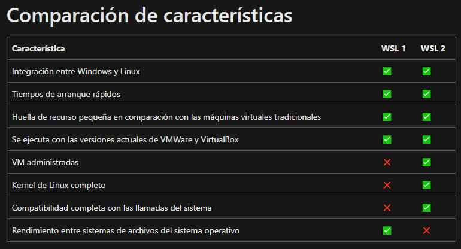

# <b>VENTAJAS DE WSL 2</b>

Las principales ventajas de WSL 2 frente a una [<b>máquina virtual</b>][1_0] son:

* WSL 2 está totalmente integrado con Windows, a diferencia de una máquina virtual que está aislado.

* Mientras que una máquina virtual puede ser bastante más lenta a la hora de arrancar el sistema, WSL 2 puede cargar Linux en tan solo un segundo.

* WSL 2 es muy ligero y gasta muy poca memoria RAM, una maquina virtual consume muchos más recursos.

* WSL 2 solo se ejecuta cuando lo necesitamos y solo carga los procesos y servicios necesarios para lo que necesitamos hacer.

* WSL 2 cuenta con un hipervisor nativo que permite ejecutar un Kernel real directamente en Windows.

[1_0]:https://es.wikipedia.org/wiki/M%C3%A1quina_virtual

---

## <b>Mas Información</b>

* [Todo sobre WSL, la mejor forma de instalar Linux en Windows 10][1_1]
* [Que es el Windows Subsystem Linux](1_2)

[1_1]:https://di.sld.cu/todo-sobre-wsl-la-mejor-forma-de-instalar-linux-en-windows-10/
[1_2]:https://www.softzone.es/windows/como-se-hace/subsistema-windows-linux/